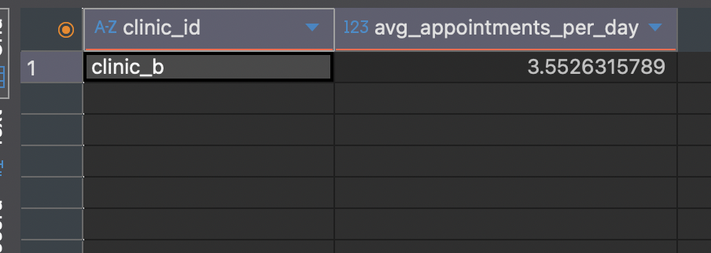

# Clinic Appointments Data Pipeline

## Tech Stack
- Apache Airflow
- PostgreSQL
- Docker & docker-compose
- Python (pandas, SQLAlchemy)

## ️Features
- Error handlings
- Logging
- Data quality checks
- Incremental processing
- Orchestration
- Unit test
- Idempotency

## Quick Start
### 1. Clone the repository
```bash
git clone https://github.com/tomekzakrzewski/docplanner-appointments.git
cd docplanner-appointments
```

---

### 2. Set up environment
```bash
cp .env.example .env
```

---

### 3. Build and start services
Make sure you have **Docker** running:
```bash
docker-compose build
docker-compose up -d
```

---

### 4. Access Airflow UI
- URL: [http://localhost:8080](http://localhost:8080)  
- Username: `airflow`  
- Password: `airflow`  

---

### 5. Run tests
```bash
docker-compose --profile test run --rm test
```

---

### 6. Access PostgreSQL Database
- Port: `5432` 
- Host: `localhost` 
- Database: `airflow`
- Username: `airflow`
- Password: `airflow`  

---
## Pipeline Flow
```
CSV -> Validate -> Clean -> Stage -> Quality Checks -> Agg Table -> Comparison DQ
```

## Steps

1. **File Discovery** - (`extract_source_file`), Find `appointments_YYYY_MM_DD.csv` for yesterday's date
2. **File Validation** - (`validate_source_file`), Check file integrity, required columns, non-empty data
3. **Data Cleaning** - (`clean_source_data`), Normalize clinic IDs, parse timestamps, remove nulls/invalids
4. **Staging Load** - (`load_stg_daily_appointments`), Load cleaned data to `stg_daily_appointments` table
5. **Staging DQ** -  (`dq_checks_staging`), Validate row counts, nulls, duplicates
6. **Agg Load** - (`load_agg_daily_appointments`), Aggregate by clinic/date, load to `agg_daily_appointments`
7. **Agg DQ** - (`dq_check_comparison`), Verify staging totals count agains agg table sums

**Tables schemas**
- Tables are created when docker-compose is ran
```
    CREATE TABLE IF NOT EXISTS stg_daily_appointments (
        appointment_id BIGINT,
        clinic_id VARCHAR(255),
        patient_id BIGINT,
        created_at DATE
    );
```
```
    CREATE TABLE IF NOT EXISTS agg_daily_appointments (
        clinic_id VARCHAR(255) NOT NULL,
        appointment_date DATE NOT NULL,
        appointments_count INTEGER,
        PRIMARY KEY (clinic_id, appointment_date)
    );
```

## Potential failures & solutions

### 1. File Discovery Issues
**Problem:** `FileNotFoundError: File: appointments_YYYY_MM_DD.csv not found`  
- **Cause:** Missing source file for the scheduled date  
- **Solutions:**  
  - Verify file naming follows exact pattern `appointments_YYYY_MM_DD.csv`  
  - Check file exists in `/opt/airflow/data/` directory  
  - Ensure file permissions allow read access  
  - For backfill runs, verify historical files are available  

---

### 2. Schema Validation Failures
**Problem:** `ValueError: Missing required columns`  
- **Cause:** CSV file missing expected columns: `appointment_id`, `clinic_id`, `patient_id`, `created_at`  
- **Solutions:**  
  - Verify CSV header matches expected schema exactly  
  - Check for typos in column names  
  - Ensure CSV is not corrupted or truncated  

---

### 3. Data Quality Check Failures
**Problem:** DQ check **row_count_check** failed  
- **Cause:** Mismatch between expected and actual row counts after cleaning  
- **Solutions:**  
  - Review data cleaning logic in `clean_appointment_data`  
  - Check for excessive null/invalid records being filtered out  
  - Verify timestamp parsing is working correctly  

**Problem:** Found duplicate `appointment_id`s  
- **Cause:** Same appointment appears multiple times  
- **Solutions:**  
  - Check source system for duplicate generation  

---

### 4. Reconciliation Check Failures
**Problem:** DQ check **dq_check_comparison** failed  
- **Cause:** Fact table counts don't match staging table  
- **Solutions:**  
  - Check aggregation logic in `load_agg_table` function  
  - Verify date filtering is consistent between queries  
  - Look for timezone conversion issues  


## SQL queries
**highest average number of appointments per day**
```
SELECT 
    clinic_id,
    AVG(appointments_count) as avg_appointments_per_day
FROM agg_daily_appointments
GROUP BY clinic_id
ORDER BY avg_appointments_per_day DESC
LIMIT 1;
```


**most appointments overall**
```
SELECT 
    TO_CHAR(appointment_date, 'Day') as day_name,
    SUM(appointments_count) as app_count
FROM agg_daily_appointments
GROUP BY day_name
ORDER BY app_count desc
LIMIT 1
```

